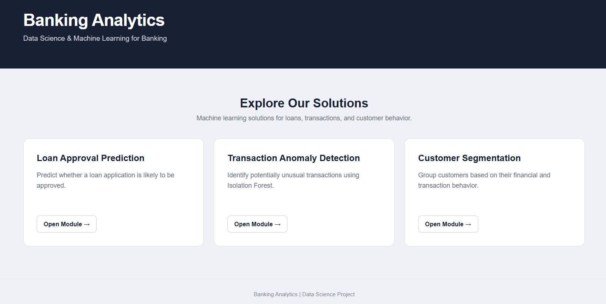
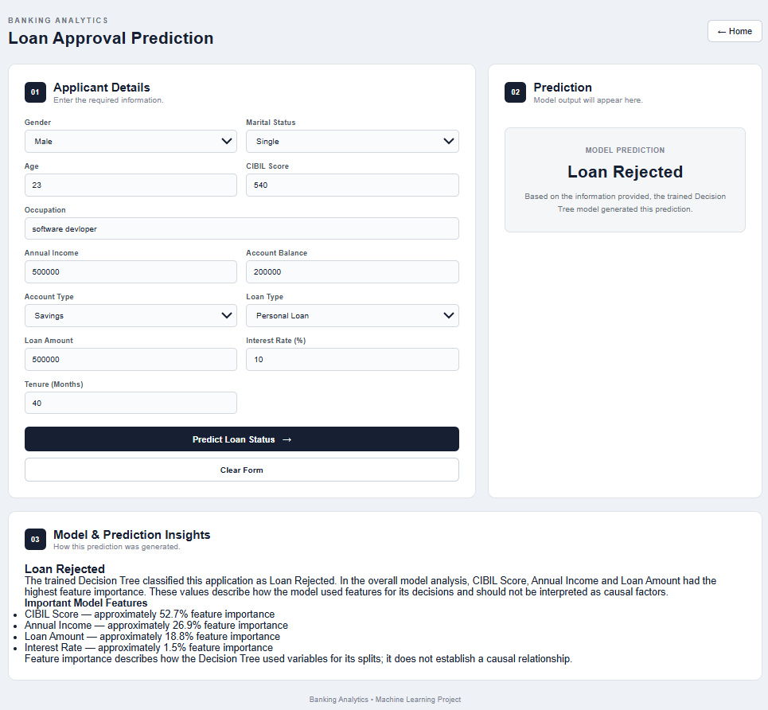
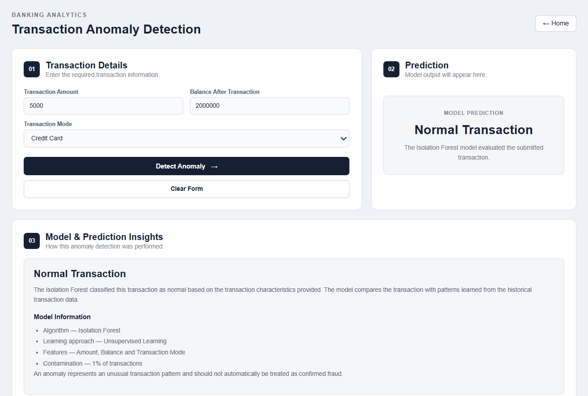
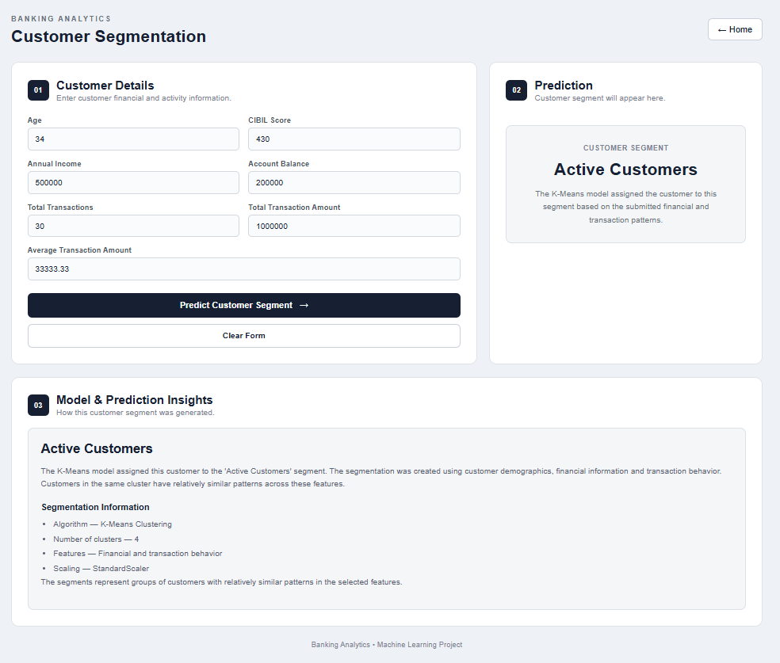

# 🏦 Banking Analytics

An end-to-end Banking Analytics and Machine Learning project built to analyze banking data, identify customer patterns, detect suspicious transactions, and predict loan approval outcomes.

The project covers the complete journey from **data generation and SQL analysis to data cleaning, machine learning, Flask development, and live deployment**.

## 🌐 Live Demo

👉 **[Live Banking Analytics Application](https://banking-analytics-5yva.onrender.com/)**

The live application provides three machine learning use cases:

- Loan Approval Prediction
- Transaction Anomaly Detection
- Customer Segmentation

---

## 📌 Project Overview

The goal of this project is to build a practical banking analytics system using customer, account, loan, and transaction data.

The project was developed from scratch and includes:

- Synthetic banking data generation
- MySQL database design
- SQL analysis
- Data cleaning and validation
- Exploratory Data Analysis
- Machine Learning
- Model evaluation
- Model serialization
- Flask web application
- Live deployment using Render

---

## 🎯 Business Use Cases

### 1. Loan Approval Prediction
Predict whether a loan application is likely to be:
- Approved
- Rejected

The model uses customer and loan-related information such as:
- Age
- Gender
- Marital Status
- Occupation
- Annual Income
- CIBIL Score
- Account Type
- Account Balance
- Loan Type
- Loan Amount
- Interest Rate
- Tenure
- EMI

#### Models Tested
- Logistic Regression
- Decision Tree Classifier

The final application uses a Decision Tree Classifier with `max_depth=10`.

#### Model Results (Test Accuracy)

- **Logistic Regression:** 85.60%
- **Decision Tree (max_depth=10):** 99.88%

> **Note on Performance:** The high accuracy of the Decision Tree is due to synthetic rule-based target generation, allowing the tree to capture clear decision boundaries. In production on noisy real-world banking data, ensemble models (such as Random Forest or XGBoost) with cross-validation would be used to prevent overfitting.

---

### 2. 🚨 Transaction Anomaly Detection
The transaction dataset does not contain confirmed fraud labels.
Therefore, an unsupervised anomaly detection approach was used.

#### Algorithm
**Isolation Forest**

The model analyzes:
- Transaction Amount
- Balance After Transaction
- Transaction Mode

The application classifies transactions as:
- Normal
- Potentially Suspicious

> An anomaly does not necessarily mean confirmed fraud. Suspicious transactions require further investigation.

#### Model Configuration
```python
IsolationForest(
    n_estimators=100,
    contamination=0.01,
    random_state=42,
    n_jobs=-1
)
```
---
### 3. 👥 Customer Segmentation
Customer segmentation was performed using K-Means Clustering.

The objective is to group customers based on their financial and transaction behavior.

#### Features Used

- Age
- Annual Income
- CIBIL Score
- Account Balance
- Total Transactions
- Total Transaction Amount
- Average Transaction Amount

The selected number of clusters was **K = 4**.

| Cluster | Segment |
|---------|---------|
| 0 | Low Activity Customers |
| 1 | Active Customers |
| 2 | High Balance Customers |
| 3 | High Income Customers |

---
### 🏗️ Project Architecture
```
                    ┌─────────────────────┐
                    │    Banking Data     │
                    │ Customers / Loans   │
                    │ Accounts /          │
                    │ Transactions        │
                    └──────────┬──────────┘
                               │
                               ▼
                    ┌─────────────────────┐
                    │       MySQL         │
                    │   Database Layer    │
                    └──────────┬──────────┘
                               │
                               ▼
                    ┌─────────────────────┐
                    │ Data Cleaning & EDA │
                    │    Pandas / SQL     │
                    └──────────┬──────────┘
                               │
                               ▼
              ┌────────────────────────────────┐
              │       Machine Learning         │
              │                                │
              │ Loan Approval → Decision Tree  │
              │ Anomaly Detection → Isolation  │
              │ Forest                         │
              │ Segmentation → K-Means         │
              └───────────────┬────────────────┘
                              │
                              ▼
                    ┌─────────────────────┐
                    │    Saved Models     │
                    │        .pkl         │
                    └──────────┬──────────┘
                               │
                               ▼
                    ┌─────────────────────┐
                    │    Flask Web App    │
                    │    HTML / CSS / JS  │
                    └──────────┬──────────┘
                               │
                               ▼
                    ┌─────────────────────┐
                    │       Render        │
                    │   Live Deployment   │
                    └─────────────────────┘
```
---
#### 📂 Project Structure:
```
Banking-Analytics/
│
├── Data/
│
├── Notebooks/
│   ├── 01_Create_Database.ipynb
│   ├── 02_Create_Tables.ipynb
│   ├── 03_Generate_Data.ipynb
│   ├── ...
│
├── ML/
│   ├── A_Loan_Approval_Prediction.ipynb
│   ├── B_Transaction Anomaly Detection.ipynb
│   └── C_Customer_Segmentation.ipynb
│
├── Models/
│   ├── loan_approval_model.pkl
│   ├── loan_approval_preprocessor.pkl
│   ├── transaction_anomaly_model.pkl
│   ├── transaction_anomaly_scaler.pkl
│   ├── customer_segmentation_model.pkl
│   └── customer_segmentation_scaler.pkl
│
├── screenshots/
│   ├── home.png
│   ├── loan-approval.png
│   ├── transaction-anomaly.png
│   └── customer-segmentation.png
│
├── templates/
├── static/
├── app.py
├── requirements.txt
├── .gitignore
└── README.md
```
---
#### 🛠️ Tech Stack
Programming:
- Python
  
Data Analysis:
- Pandas
- NumPy
  
Database:
- MySQL
- SQLAlchemy
- PyMySQL
  
Machine Learning:
- Scikit-learn
- Logistic Regression
- Decision Tree
- Isolation Forest
- K-Means Clustering
- StandardScaler
- OneHotEncoder
- ColumnTransformer
  
Web Development:
- Flask
- HTML
- CSS
- JavaScript
  
Deployment:
- GitHub
- Render
  
Development:
- Jupyter Notebook
- Anaconda
---
#### 🧹 Data Cleaning & Validation
Before applying machine learning, the banking data was cleaned and validated.

Major checks included:
- Duplicate detection
- Missing value handling
- Data type validation
- Numerical range validation
- Loan EMI consistency
- Transaction balance consistency
- Transaction date validation
- Customer-account relationship validation
- Loan-customer relationship validation
  
The cleaned transaction dataset contains:
748,514 transactions
---
#### 📊 Dataset
The project uses synthetic banking data created specifically for this project.
Major entities include:
- Customers
- Accounts
- Loans
- Transactions
  
>The data was generated to provide banking scenarios for SQL analysis, data cleaning, and machine learning.
---
#### 🤖 Machine Learning Workflow:
```
                      Raw Data
                         ↓
                      Data Cleaning
                         ↓
                      Feature Selection
                         ↓
                      Train-Test Split
                         ↓
                      Feature Preprocessing
                         ↓
                      Model Training
                         ↓
                      Prediction
                         ↓
                      Model Evaluation
                         ↓
                      Model Serialization
                         ↓
                      Flask Integration
```

---
#### 📸 Application Screenshots
### 🏠 Home Page


### 💰 Loan Approval Prediction


### 🚨 Transaction Anomaly Detection


### 👥 Customer Segmentation

---
#### ⚙️ Local Setup

1. Clone the Repository

```bash
git clone https://github.com/Rishiraj-Singh-Thakur/Banking-Analytics.git
cd Banking-Analytics
```

2. Create a Virtual Environment

```bash
python -m venv venv
```

 Activate it on Windows:

```bash
venv\Scripts\activate
```

3. Install Dependencies

```bash
pip install -r requirements.txt
```

4. Run the Flask Application

```bash
python app.py
```

The application will be available at:

```text
http://127.0.0.1:5000/
```

---
#### 🔐 Environment Variables
Database credentials are stored using environment variables instead of hard-coded credentials.
```env
DB_HOST=localhost
DB_USER=root
DB_PASSWORD=your_password
```
The .env file is excluded from Git using .gitignore
---
#### 🚀 Deployment
The Flask application is deployed using Render.
Deployment flow:
```
            GitHub Repository
                   ↓
            Render
                   ↓
            Install Dependencies
                   ↓
            Gunicorn
                   ↓
            Flask Application
                   ↓
            Live Web Application
```
---
### 📚 Key Learnings
Through this project, I worked on:

- Designing a banking database
- Generating large-scale synthetic datasets
- Writing SQL queries for analytics
- Cleaning and validating banking data
- Performing exploratory data analysis
- Preparing datasets for machine learning
- Handling numerical and categorical features
- Comparing machine learning models
- Building unsupervised anomaly detection
- Performing customer segmentation
- Saving and loading ML models
- Integrating ML models with Flask
- Building a user-friendly prediction interface
- Deploying a Python application to the cloud
---
### 🔮 Future Improvements
Possible future improvements include:
- Better fraud detection using labeled fraud data
- Model explainability using SHAP
- Customer-level anomaly detection
- Model monitoring
- Authentication and user management
- Additional banking analytics
- Improved model validation using cross-validation
---
## 👨‍💻 Author

**Rishiraj Singh Thakur**  
*Data Science | Machine Learning | Python | SQL*

- 🌐 **Live Demo:** [banking-analytics-5yva.onrender.com](https://banking-analytics-5yva.onrender.com/)
- 💻 **GitHub Repository:** [Rishiraj-Singh-Thakur/Banking-Analytics](https://github.com/Rishiraj-Singh-Thakur/Banking-Analytics)
- 💼 **LinkedIn:** [rishiraj-singh-thakur-jerry01](https://www.linkedin.com/in/rishiraj-singh-thakur-jerry01/)
- 🐦 **X (Twitter):** [@RishirajSingh_X](https://x.com/RishirajSingh_X)
- 📧 **Email:** [rishiirajsinghthakur@gmail.com](mailto:rishiirajsinghthakur@gmail.com)
---

## ⭐ Project Highlights

- ✅ **End-to-End Delivery:** From raw synthetic data generation to cloud deployment.
- ✅ **Relational Database:** MySQL schema design, relational constraints, and analytical SQL queries.
- ✅ **Robust Preprocessing:** Complete data cleaning, validation checks, and feature pipelines.
- ✅ **3 Applied ML Workflows:** Classification (Loan Approval), Anomaly Detection (Isolation Forest), and Segmentation (K-Means).
- ✅ **Full-Stack ML Integration:** Models serialized with `pickle` and served via Flask.
- ✅ **Production Deployment:** Live web application hosted on Render with Gunicorn.
